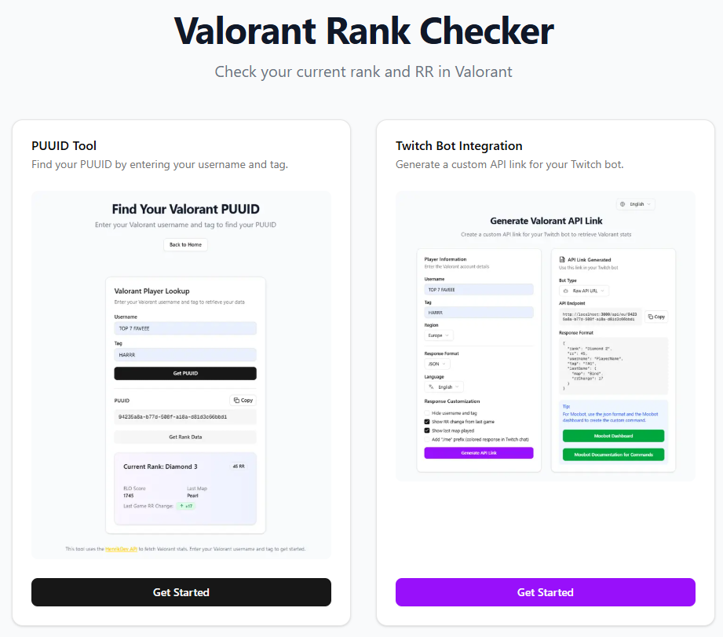

# Valorant Rank Checker & Twitch Bot Integration

<div align="center">
  
</div>

## 📋 Vue d'ensemble

Valorant Rank Checker est un outil web qui permet de vérifier votre rang Valorant et de l'intégrer facilement à votre chat Twitch. Compatible avec les bots Twitch les plus populaires comme Nightbot, StreamElements, Wizebot, Fossabot et Streamlabs.

**Site web:** [https://api-rank-valo-production.up.railway.app/](https://api-rank-valo-production.up.railway.app/)

## 🎮 Démonstration

### Fonctionnement dans Twitch Chat
Exemple avec Nightbot:
```
Utilisateur: !rank
Nightbot: MonJoueur#TAG | Diamond 2 : 45 RR | Change on the last game : +17 on Bind
```

### Différents bots supportés
- **Nightbot**: `!addcom !rank $(customapi URL)`
- **StreamElements**: `!command add !rank $(customapi.URL)`
- **Wizebot**: `!addcom !rank $urlcall(URL)`
- **Fossabot**: `!addcommand !rank $(customapi URL)`
- **Streamlabs**: `!addcommand !rank {readapi.URL}`

## ✨ Fonctionnalités

### 🔍 Recherche de PUUID
- Récupérez facilement votre identifiant unique Valorant (PUUID)
- Saisissez simplement votre nom d'utilisateur et votre tag
- Copiez le PUUID en un clic

### 🤖 Intégration avec Bots Twitch
- Création de lien API personnalisé pour les commandes de chat
- Compatible avec de nombreux bots:
  - Nightbot
  - StreamElements
  - Wizebot
  - Fossabot
  - Streamlabs
  - Et plus encore (via URL API brute)
- Options de format de réponse: JSON ou Texte

### 🛠️ Personnalisation
- Affichage/masquage du nom d'utilisateur
- Affichage/masquage du changement de RR de la dernière partie
- Affichage/masquage de la dernière carte jouée
- Préfixe "/me" pour des réponses colorées (selon compatibilité du bot)
- Interface disponible en français et en anglais

## 📱 Comment utiliser

### Trouver votre PUUID
1. Accédez à [la page PUUID](https://api-rank-valo-production.up.railway.app/puuid)
2. Entrez votre nom d'utilisateur Valorant (celui affiché en jeu)
3. Entrez votre tag (par exemple, EU1, NA1, etc.)
4. Cliquez sur "Rechercher"
5. Copiez le PUUID affiché pour d'autres utilisations ou API

### Générer un lien pour votre bot Twitch
1. Accédez à [la page de génération de lien](https://api-rank-valo-production.up.railway.app/generate-link)
2. Entrez vos informations de compte Valorant (nom d'utilisateur et tag)
3. Sélectionnez votre région, format de réponse et langue préférée
4. Personnalisez les options d'affichage selon vos préférences:
   - Masquer le nom d'utilisateur si vous préférez plus de discrétion
   - Afficher ou masquer les changements de RR
   - Afficher ou masquer la dernière carte jouée
   - Ajouter le préfixe "/me" pour des réponses colorées
5. Cliquez sur "Générer le lien API"
6. Sélectionnez votre type de bot Twitch dans le menu déroulant
7. Copiez la commande complète générée (y compris la syntaxe de votre bot)
8. Collez et exécutez cette commande dans votre chat Twitch pour l'ajouter

## 🌐 Langues supportées
- 🇫🇷 Français
- 🇬🇧 Anglais

## 🔧 API et Format des données

### Format JSON
```json
{
  "rank": "Diamond 2",
  "rr": 45,
  "username": "PlayerName",
  "tag": "TAG",
  "lastGame": {
    "map": "Bind",
    "rrChange": 17
  }
}
```

### Format Texte
```
Username#Tag | Diamond 2 : 45 RR | Change on the last game : +17 on Bind
```

## 📝 Notes
- Ce service utilise l'API non-officielle HenrikDev pour récupérer les données Valorant
- Les données sont mises à jour en temps réel à chaque requête
- Pour Moobot, il est recommandé d'utiliser le format JSON et de configurer la commande via le dashboard

## 🔒 Confidentialité et Sécurité
Valorant Rank Checker ne stocke aucune information personnelle. Toutes les requêtes sont traitées en temps réel et aucune donnée n'est conservée sur nos serveurs.

---

Créé avec ❤️ pour la communauté Valorant 